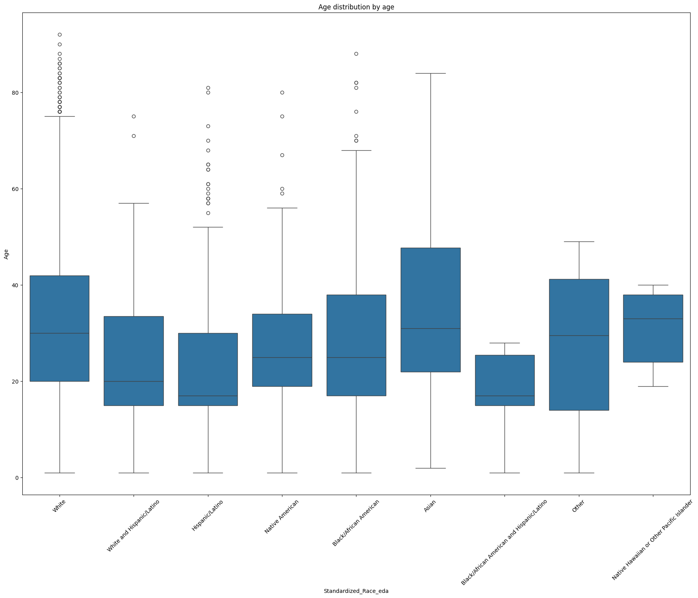
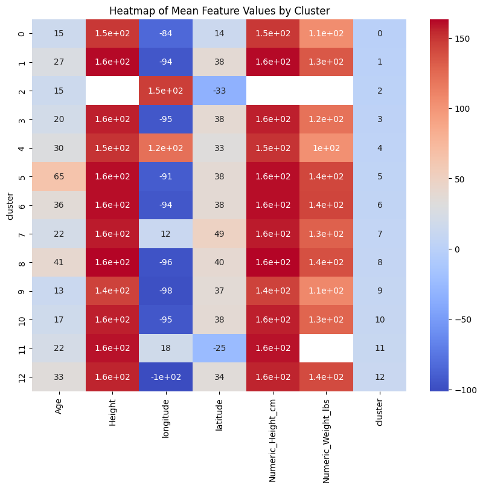

# Unsupervised Machine Learning on the Missing Females USA Dataset

## Project Overview

This project analyses data from missing Females in the USA, downloaded from [Kaggle](https://www.kaggle.com/datasets/ahmedemadeldin/missing-females-in-us/data). I have performed Exploratory Data Analysis(EDA), KMeans, and Spatial clustering. 

#### Project Streamlit App : 

## Project's Folder Structure

This project is organized into three folders, each serving a specific purpose. Below is the structure and description of these directories:

- `/data_csv`: The folder that contains all CSV tables which have been used for the project.

- `/plots`: This folder houses all the plots generated as part of this project.

- `/notebooks`: This folder houses all model calculations, including data preprocessing, model training, parameter tuning, and evaluation metrics. 

- `/html`: The folder houses all html/maps files generated.
 
## Data Description

This dataset contains records of females reported missing across various states in the United States from the year 1944 to 2020. In addition, the author added MP cases across the globe. There are 6858 unique values in total. 

The dataset comprises the following columns:

- **name**: Full name of the missing person.
- **Nicknames / Aliases**: Any known nicknames or aliases.
- **Date**: The date when the person was reported missing.
- **Location**: The last known location of the missing person.
- **Age**: Age of the person at the time they were reported missing.
- **Race**: Racial background of the person.
- **Height**: Height of the person at the time they were reported missing.
- **Weight**: Weight of the person at the time they were reported missing.
- **Description**: A brief description of the circumstances surrounding the disappearance.
- **Links**: URLs to websites where more information about the case is available.
- **longitude**: Longitude coordinate of the last known location.
- **latitude**: Latitude coordinate of the last known location.

## Analysis 

Given the nature of the Missing Females dataset, which predominantly lacks labeled data, the use of unsupervised machine learning (ML) models is most appropriate for analysis. This approach allows for the exploration of inherent structures within the dataset without predefined labels or categories.

### Exploratory Data Analysis (EDA)

Before applying any machine learning techniques, it is crucial to perform an exploratory data analysis (EDA). This initial phase involves:

- **Handling Missing Data**: Given the significant number of missing entries in our dataset, all rows containing NaN values were dropped. This step simplifies initial analyses but reduces the dataset size, which could impact the statistical power of subsequent analyses.
- **Reduced Dataset**: A new dataset with a smaller number of cases was created post-cleaning, allowing for more manageable and focused analyses.
- **Race Column**: The 'Race' column was transformed to standardize the categories and consolidate sparse classes into a comprehensible set of groups, enhancing the clarity and usability of racial data in analyses.
- **Correlation**: Spearman correlation coefficients are computed to evaluate the relationships between numerical variables.
- **Grouped Data Analysis**: Data is grouped by the standardized 'Race' category to compute mean age, height, and weight, providing insights into racial demographics of the dataset.
- **Age, Height and Weight Distribution**: A histogram is used to visualize the distribution of ages, height and weight within the dataset.

### K-means Clustering

The dataset contains a significant number of missing entries across various features. Strategies such as imputation for numerical data and substitution for categorical data (using modes or other logical substitutes) will be employed.

After preprocessing the data, K-means clustering will be applied to identify groups based on features such as Age, Height, and Weight. This method partitions the data into K distinct clusters based on feature similarity. 

#### Optimizing the Number of Clusters

- **Silhouette Score**: Utilize the silhouette score to determine the optimal number of clusters.
- **Cluster Validation**: After running the K-means algorithm with varying numbers of clusters (up to 20). The optimal number of clusters was found to be 13.

#### Calculating Centroids and Data Visualization

- **Centroids**: Each cluster's centroid is calculated, representing the mean position of all the points in the cluster.
- **Cluster Visualization**: Visualize the clusters using a scatter plot to display how data points are grouped together and separated in space.
- **Radar Chart**: Each cluster's centroid values on the radar chart can provide a visual summary of the cluster's defining characteristics compared to others.
- **Heat Map**: A heat map of the centroids can be used to visualize the intensity of different features across clusters, providing insights into which features drive cluster formation.

### Spatial Clustering with DBSCAN

Given the geographic data (longitude and latitude) available in the dataset, Density-Based Spatial Clustering of Applications with Noise (DBSCAN) will be a useful method to discover clusters based on geographical proximity. This approach is particularly adept at:
- Identifying clusters of varying shapes and sizes, unlike K-means which assumes spherical clusters.
- For simplicity and focus, the analysis includes only the locations within the USA and Canada. This filtering helps concentrate the analysis on areas with higher data density and relevance. 

#### DBSCAN Configuration

- **Parameter Selection**:
  - `eps` (epsilon): The maximum distance between two samples for them to be considered as in the same neighborhood.
  - `min_samples`: The number of samples in a neighborhood for a point to be considered as a core point. This includes the point itself.

#### Optimizing Cluster Formation and Visualization.

- **Silhouette Score**: To identify the most effective DBSCAN parameters, the silhouette score was used. The best parameters (eps = 0.1, min_samples = 9) were those that maximized the silhouette score.
- **Cluster Mapping**: Geographic clusters are visualized using maps to show the spatial distribution of missing cases. This visualization helps identify hotspots and patterns in the geographical data.
- **Cluster Characteristics**: Analyze the geographic and demographic characteristics of each cluster to understand potential commonalities or trends among the cases in each region.

## Findings

This analysis of the Missing Females in the US dataset from 1944 to 2020 has utilized a range of statistical and machine learning techniques to uncover patterns and insights into the cases of missing females. Key findings from the study include:

1. The EDA and subsequent ANOVA testing highlighted significant differences in the ages of missing females across different racial groups, suggesting that certain demographics are disproportionately affected.
2. The spatial analysis using DBSCAN revealed distinct geographical hotspots for missing females, indicating regional trends.
3. The application of K-means clustering helped identify common characteristics within subsets of the data, potentially aiding in the profiling of cases that are likely to have similar outcomes.

## Limitations

The study faces limitations due to the significant amount of missing data, which might have introduced bias in the analysis. The filtering out of cases with missing information may also have excluded relevant cases that could affect the generalizability of the findings.
